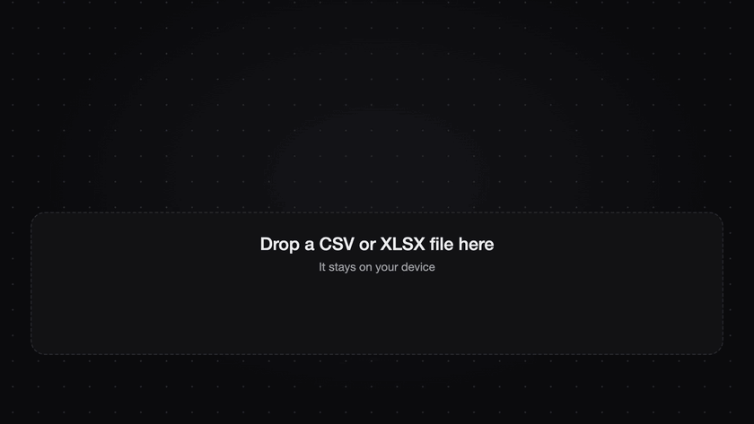

# csv-xlsx-2-parquet — CSV and XLSX to Parquet, in the browser

A static web app that converts CSV and Excel files to [Parquet](https://parquet.apache.org).
Drop a file, check the preview, fix the column types and download the result. There is no
backend: the conversion runs in your browser with DuckDB-WASM.



The same clip in 1080p: [docs/demo.mp4](docs/demo.mp4).

## Features

- Drag and drop or pick a `.csv` or `.xlsx` file; workbooks with several sheets get a sheet picker.
- Preview of the first 50 rows, exactly as read from the file.
- A type is detected for every column (text, integer, decimal, boolean, date) and can be overridden.
- Understands `dd/mm/yyyy` dates and comma decimals (`1.234,56`), and keeps codes with leading
  zeros (`00123`) as text.
- Downloads a ZSTD-compressed Parquet file and shows the original size, the Parquet size and the row count.
- Clear errors for unsupported or unreadable files and for values that do not fit the chosen type.
- Files of tens of MB convert without freezing the page: all the work happens in web workers.

## Why everything runs on the client

Spreadsheets tend to hold data that should not be sent to someone else's server: customers,
invoices, salaries. Here the file is read by a database engine compiled to WebAssembly and
running inside the page, so:

- **Nothing is uploaded.** After the page loads, the app makes no request with your data. The
  engine and its workers are served from the same site, not from a CDN.
- **No server to trust, pay for or keep running.** The site is a folder of static files.
- **It keeps working offline** once the page and the engine have been loaded.

## Stack

- [Astro 7](https://astro.build) with static output (`output: 'static'`)
- [DuckDB-WASM](https://duckdb.org/docs/api/wasm/overview) to read the data, cast it with SQL and write Parquet with `COPY ... TO`
- [SheetJS](https://sheetjs.com) to read `.xlsx` files, in its own web worker
- [Tailwind CSS v4](https://tailwindcss.com) through the Vite plugin
- TypeScript in strict mode, no UI framework

## Getting started

Requires Node.js 22.12 or newer.

```sh
npm install
npm run dev       # dev server at http://localhost:4321
```

| Command           | What it does                                          |
| ----------------- | ----------------------------------------------------- |
| `npm run dev`     | Start the dev server with hot reload                  |
| `npm run check`   | Type-check `.astro` and `.ts` files (the project lint) |
| `npm run build`   | Build the static site into `dist/`                    |
| `npm run preview` | Serve the production build locally                    |
| `npm run samples` | Regenerate the files in `public/samples/`             |

Run `npm run check` and `npm run build` before pushing; there is no test suite.

Two sample files live in `public/samples/` and can be loaded from the dropzone: `sales.csv`
(semicolon separated) and `sales.xlsx` (three sheets, one of them empty). Both include
`dd/mm/yyyy` dates, comma decimals, zero-padded codes and empty cells.

## Deploying to GitHub Pages

The workflow in `.github/workflows/deploy.yml` type-checks, builds and publishes the site on
every push to `main`.

1. Push the repository to GitHub.
2. In **Settings → Pages**, set **Source** to **GitHub Actions**.
3. Push to `main`, or run the workflow by hand from the **Actions** tab.

The site URL and the base path (`/<repository>/` for a project site) come from the Pages
configuration, so nothing has to be edited. To reproduce that build locally:

```sh
SITE_URL=https://<user>.github.io BASE_PATH=/<repository> npm run build
SITE_URL=https://<user>.github.io BASE_PATH=/<repository> npm run preview
```

## SEO

The page is static HTML, so its content is indexable without running JavaScript. It ships with:

- a descriptive title, meta description, canonical URL and `robots` meta tag;
- Open Graph and Twitter tags with a 1200×630 preview image (`public/og-default.png`);
- JSON-LD structured data: `WebApplication` and `FAQPage`, built from the visible FAQ;
- `sitemap-index.xml` (`@astrojs/sitemap`) and `robots.txt`, both using the deployed URL.

Titles, description and keywords live in `src/config/site.ts`; the steps and the FAQ in
`src/data/faq.ts`.

To get the site into Google:

1. Add the site as a URL-prefix property in [Google Search Console](https://search.google.com/search-console).
2. Choose the HTML tag verification method and paste the token into `googleSiteVerification`
   in `src/config/site.ts`, then deploy.
3. Submit `https://<user>.github.io/<repository>/sitemap-index.xml` under **Sitemaps** and
   request indexing of the home page with **URL inspection**.

On a GitHub Pages project site, `robots.txt` is served under `/<repository>/`, where crawlers
do not look for it; only a `robots.txt` at the root of the domain counts. That is harmless here
(everything is allowed), but it means the sitemap has to be submitted by hand. With a custom
domain, or a `<user>.github.io` repository, it is picked up automatically.

## Project structure

```
public/samples/         Sample CSV and XLSX files
scripts/make-samples.mjs  Generates the samples
src/
  config/site.ts        Name, titles, description, keywords, repository, preview size
  data/faq.ts           Steps and FAQ shown on the page and in the structured data
  layouts/BaseLayout.astro
  components/
    layout/             Header, footer, theme toggle
    pages/              One component per page; route files render these
    seo/                Meta tags and JSON-LD
    ui/                 Dropzone, file bar, stats, schema and preview tables, alert, FAQ
  lib/
    client.ts           Single client entry point
    seo.ts              Absolute URLs and JSON-LD builders
    converter/          State, DOM rendering and the controller that wires them
    duckdb/             Lazy engine, ingest, type inference, SQL helpers, export
    xlsx/               SheetJS worker and its promise-based client
  pages/                Route files (thin wrappers)
  styles/index.css      Design tokens and shared component classes
```

How the pieces fit is described in [docs/ARCHITECTURE.md](docs/ARCHITECTURE.md); the
conventions to follow when changing code are in [AGENTS.md](AGENTS.md).

## Technical decisions

- **Everything is read as text first.** The file is loaded with `all_varchar = true` and types are
  applied afterwards with SQL. Letting the CSV reader guess would turn `00123` into `123` and
  read `03/04/2025` as March 4th.
- **A type is detected only if every value fits it.** One stray value keeps the column as text
  instead of producing nulls. When a type is forced by hand, the values that would be lost are listed
  and the export is blocked until the type is changed.
- **SheetJS instead of DuckDB's `excel` extension.** The extension does load in DuckDB-WASM, but it
  is downloaded at runtime from DuckDB's extension repository, which breaks the "no third-party
  request" promise, and in testing it did not detect the header row of the sample workbook. SheetJS
  is bundled with the site, runs in a worker and is installed from `cdn.sheetjs.com` as its
  maintainers recommend.
- **DuckDB is loaded lazily.** The landing page ships about 17 KB of JavaScript. The engine is
  fetched when the pointer reaches the dropzone or a file is chosen.

## Known limitations

- The first conversion downloads the DuckDB engine (about 36 MB, roughly 8 MB compressed by the
  host); it is cached afterwards.
- The file has to fit in the memory of the browser tab. Files of tens of MB are fine; several
  hundred MB may not be.
- `.xls` (the old binary format) and password-protected workbooks are not supported.
- The first row is always taken as the header.
- Dates are day-first (`dd/mm/yyyy`, `dd-mm-yyyy`, `dd.mm.yyyy`) or ISO (`yyyy-mm-dd`). Month-first
  dates are not detected.
- A value like `1,234` is read as a comma decimal (1.234), not as one thousand two hundred thirty-four.
- Integers are 64-bit and decimals are doubles; there is no fixed-precision decimal type.
